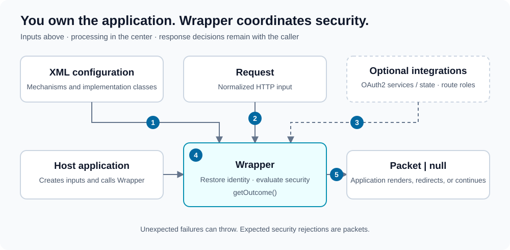
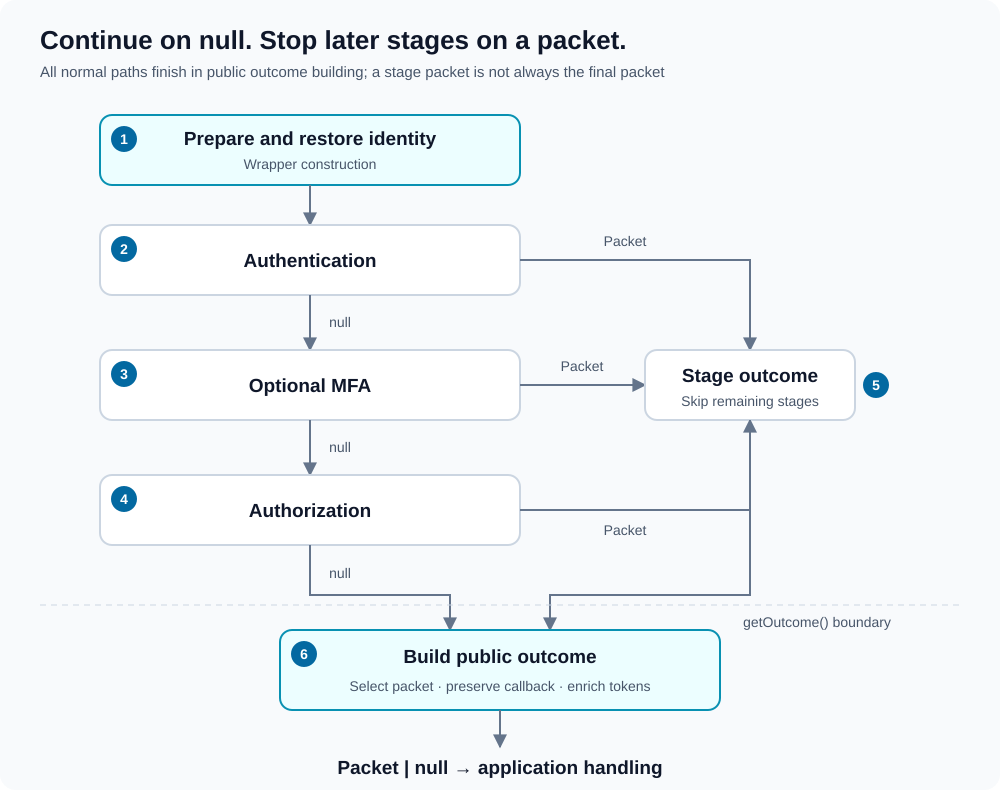

# Lucinda Security

Configuration-driven security for PHP applications: authentication, authorization, MFA, CSRF protection, identity persistence, and throttling.

**The library evaluates security and returns structured outcomes. Your application decides how to respond.**

## How it works



The numbered references describe the API contract, not execution order:

1. **Configuration:** an application XML document containing `<security>`. It selects security mechanisms and application implementation classes.
2. **Request:** normalized route, context path, client IP, HTTP method, parameters, and an optional authentication bearer token.
3. **Optional integrations:** OAuth2 provider services and a state store; a pre-parsed role detector for route-based authorization.
4. **Processing:** `Wrapper` restores identity and coordinates authentication, optional MFA, and authorization.
5. **Outcome:** `getOutcome()` returns `Packet | null`. The application owns rendering, redirects, HTTP statuses, and token delivery.

Expected rejections are outcomes, not exceptions. Unexpected configuration, persistence, or integration failures can throw. Session and cookie persistence can update headers; the library does not send your application's redirect or response body.

## Capabilities

- Form authentication through an application-supplied credentials DAO.
- OAuth2 authentication with existing-account, automatic-creation, or approval-based provisioning.
- Optional TOTP enrollment and verification, with bounded pending completion and approval freshness.
- Authorization through page/user DAOs or XML route roles, including guest access.
- CSRF tokens for login and authenticated-user contexts.
- Session, session plus remember-me, or authentication bearer-token persistence.
- Separate application-supplied throttling policies for form login and MFA.

## Installation

```bash
composer require lucinda/security
```

Requires PHP `^8.1`, `ext-SimpleXML`, and `ext-openssl`.

## Quick start

Start with session-based form authentication and DAO authorization. Copy the [example XML](docs/examples/security.xml) into your application's `security.xml`, replace its secret, and implement the five application classes it names. The [quick-start guide](docs/quick-start.md) lists their exact contracts.

Run this integration before rendering a response. This example opens the configured login form:

```php
<?php

require __DIR__ . "/vendor/autoload.php";

use Lucinda\WebSecurity\Packets\GuestUser;
use Lucinda\WebSecurity\Packets\LoggedInUser;
use Lucinda\WebSecurity\Request;
use Lucinda\WebSecurity\Wrapper;

$xml = simplexml_load_file(__DIR__ . "/security.xml");
if ($xml === false) {
    throw new RuntimeException("Unable to load security configuration.");
}

$request = new Request();
$request->setUri("login"); // Replace with your router's application-relative route.
$request->setContextPath("");
$request->setIpAddress($_SERVER["REMOTE_ADDR"] ?? "");
$request->setMethod($_SERVER["REQUEST_METHOD"] ?? "GET");
$request->setParameters($request->getMethod() === "POST" ? $_POST : $_GET);

$wrapper = new Wrapper($xml, $request);
$outcome = $wrapper->getOutcome();

if ($outcome === null) {
    // Continue as a guest on a resource allowed by the workflow.
} elseif ($outcome instanceof GuestUser) {
    $csrfToken = $outcome->getCsrfToken();
    // Render the login form with this token in its "csrf" field.
} elseif ($outcome instanceof LoggedInUser) {
    $userID = $outcome->getUserID();
    $csrfToken = $outcome->getCsrfToken();
    // Handle any success callback, or continue with this identity.
} else {
    // Handle the packet's type, status, callback, and any failure detail.
    // Do not continue to protected application logic without handling it.
}
```

The branches above illustrate the contract; connect them to your application's response layer. For proxy deployments, resolve the client IP through your trusted-proxy policy rather than blindly accepting forwarded headers.

## Understanding outcomes

A packet carries a decision or useful identity data. Its presence does not automatically mean failure, and its user ID alone does not prove completed authentication.

| Returned value | Meaning |
| --- | --- |
| `null` | No public packet is needed; execution can continue as a guest. |
| `GuestUser` | Login-form state, including the guest CSRF token. |
| `LoggedInUser` | Completed authentication, including the user ID and CSRF token; a callback may be attached. |
| `Security` | Authentication or authorization decision, such as deferral, rejected login, logout, or denied access. |
| `MultiFactor` | MFA challenge, enrollment, failure, or expired pending state. |
| `Throttling` | The configured form or MFA throttler blocks the attempt. |

A `LoggedInUser` packet is not a blanket permission for every resource: login/MFA completion can end that request before authorization. Ordinary requests that continue through the workflow receive the configured authorization check.

Read [outcomes and response handling](docs/outcomes.md) for enum statuses, callbacks, bearer-token delivery, and exceptions.

## Configuration at a glance


Four sections are required: `persistence`, `csrf`, `authentication`, and `authorization`. `multi_factor_authentication` is optional.

The tree shows containment; its numbered references identify branch rules explained in the [configuration guide](docs/configuration.md). Interface bindings and attribute reference tables live in the component guides.

## Explore the components

| Component | Read about |
| --- | --- |
| [Authentication](docs/authentication.md) | Form login, logout, OAuth2 adapters, state validation, and account provisioning. |
| [Multi-factor authentication](docs/multi-factor-authentication.md) | TOTP setup, replay protection, pending deadlines, and approval freshness. |
| [Authorization](docs/authorization.md) | Public resources, page permissions, route roles, and guest access. |
| [Persistence](docs/persistence.md) | Restoring identity, remember-me selection, bearer-token promotion and renewal. |
| [CSRF](docs/csrf.md) | Login-form tokens, authenticated-user tokens, and application-side validation. |
| [Throttling](docs/throttling.md) | XML-selected policies, penalty checks, and caller-visible outcomes. |
| [Outcomes](docs/outcomes.md) | Public packets, callback handling, token delivery, and exceptions. |

See the [documentation map](docs/index.md) for all guides and diagram conventions.

## Internal workflow

Security processing is a conditional request workflow, not an unconditional pipeline. A stage returning a packet skips the remaining security stages; `null` continues. Public outcome building follows either path.



Read [the workflow guide](docs/workflow.md) for the numbered paths and construction/getter responsibilities. The separate [authentication lifecycle](docs/multi-factor-authentication.md#authentication-lifecycle) describes persisted identity state and MFA reevaluation.

## Development

Install development dependencies and run the unit tests:

```bash
composer install
php test.php
```

From Windows, run PHP through WSL, from this repository:

```powershell
wsl -d Ubuntu --cd /home/aherne/framework/security php test.php
```

Implement the public application interfaces rather than subclassing internal orchestration classes.

## License

MIT.
