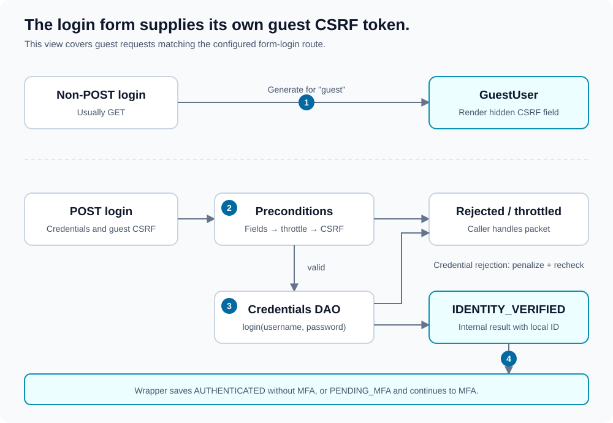
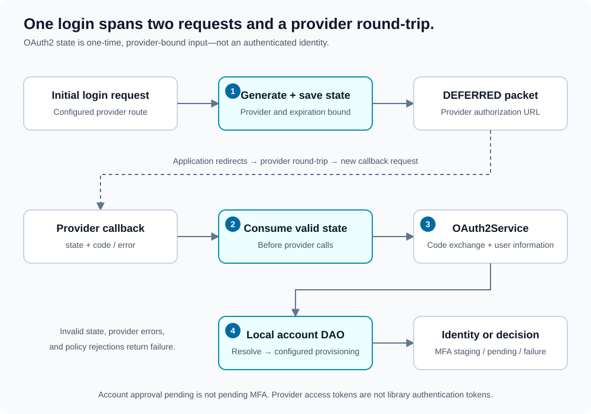

# Authentication

[Documentation map](index.md) · [MFA](multi-factor-authentication.md) · [Throttling](throttling.md)

Primary authentication establishes a local identity. Completing that step does not necessarily complete authentication: configured MFA is evaluated separately.

## Form login



1. **Open the form:** a non-POST request to the configured login route receives `GuestUser` with a CSRF token. The token uses the `"guest"` identity context and is generated only on that login-form path.
2. **Submit the form:** a guest POST must contain non-empty string username, password, and CSRF parameters. The handler checks throttling before validating CSRF and invoking the credentials DAO.
3. **Check credentials:** `DAO\FormLogin::login()` returns a non-empty eligible local ID or `null`. Rejected credentials are penalized and throttling is checked again; an attempt that reaches the threshold returns a throttling packet.
4. **Stage the identity:** successful credentials produce internal `IDENTITY_VERIFIED`. Without configured MFA, the wrapper saves `AUTHENTICATED` state. With MFA, it saves `PENDING_MFA` and continues to the MFA stage.

An existing identity visiting the login route is deferred to the configured success callback. Requests that do not match a login handler can continue to MFA and authorization.

### Form configuration

Configure `security.authentication.form`:

| Attribute | Required / default |
| --- | --- |
| `dao` | Required; class implementing `DAO\FormLogin`. |
| `throttler` | Required; class implementing `DAO\Throttler\FormLogin`. |
| `page` | Required login route. |
| `target_success` | Required success callback route. |
| `target_failure` | Required rejection callback route. |
| `target_throttled` | Required throttling callback route. |
| `parameter_username` | Optional; `username`. |
| `parameter_password` | Optional; `password`. |
| `parameter_remember_me` | Optional; `remember_me`. |
| `csrf` | Optional POST field name; `csrf`. |

Application contract:

```php
use Lucinda\WebSecurity\DAO\FormLogin;

final class FormLoginDAO implements FormLogin
{
    public function login(string $username, string $password): int|string|null
    {
        // Replace this illustrative rejection with your real account lookup,
        // eligibility checks, and password_verify() against a stored hash.
        return null;
    }
}
```

The library treats PHP-empty IDs as unsuccessful. Do not use `0`, `"0"`, or an empty string as an authenticated account ID.

## Logout

`logout` is a required sibling of `form`/`oauth2`, not a child of `form`.

| Attribute | Required / default |
| --- | --- |
| `dao` | Required; class implementing `DAO\Logout`. |
| `page` | Required logout route. |
| `target_success` | Required success callback route. |
| `target_failure` | Required failure callback route. |
| `csrf` | Optional POST field name; `csrf`. |

For an existing identity, logout requires POST and a CSRF token bound to that local user ID. The DAO's `logout(int|string $userID): bool` performs application-side operations. Acceptance produces `LOGOUT_OK`; the wrapper clears held state and all persistence drivers. A guest logout request receives `DEFERRED`.

Clearing bearer-token persistence does not revoke previously issued token copies; see [persistence limitations](persistence.md#logout-and-revocation).

## OAuth2



1. **Start:** a request to the configured provider route without callback parameters creates random state. The workflow stores it with provider name and deadline, then returns `DEFERRED` with the provider authorization URL.
2. **Return:** presence of `code`, `error`, or `state` identifies a callback. The workflow requires a non-empty state and atomically consumes it for that provider before handling errors or exchanging a code.
3. **Load provider identity:** `OAuth2Service` exchanges the code and returns normalized `DAO\OAuth2\UserInformation`.
4. **Resolve a local account:** the configured DAO first performs read-only lookup. Missing accounts follow the provisioning policy. An eligible local ID enters the same MFA staging path as form authentication.

The application follows the provider redirect; the library does not issue it.

### OAuth2 configuration

Configure `security.authentication.oauth2`:

| Attribute / child | Required / behavior |
| --- | --- |
| `dao` | Required; interface depends on provisioning policy. |
| `provisioning` | Required; `existing_only`, `automatic`, or `approval_required`. |
| `target_success` | Required local success callback. |
| `target_failure` | Required local failure callback. |
| `target_pending` | Required only for `approval_required`. |
| `state_expiration` | Required positive state lifetime in seconds. |
| `driver` | At least one child, each with required `name` and `login` attributes. |

```xml
<oauth2
    dao="App\Security\OAuth2LoginDAO"
    provisioning="existing_only"
    target_success="home"
    target_failure="login"
    state_expiration="300"
>
    <driver name="example" login="oauth/example" />
</oauth2>
```

The `login` route handles both initiation and callback. The injected service must use the corresponding callback URL when communicating with its provider.

### Application interfaces

| Interface | Responsibility |
| --- | --- |
| [OAuth2Service](../src/OAuth2Service.php) | Provider authorization URL, code exchange, and user-info mapping. |
| [OAuth2State](../src/OAuth2State.php) | Save provider-bound state and atomically validate/consume it once. |
| [UserInformation](../src/DAO/OAuth2/UserInformation.php) | Expose provider ID, name, and email. |
| [Login](../src/DAO/OAuth2/Login.php) | Read-only resolution for an eligible existing local account. |
| [AutomaticProvisioning](../src/DAO/OAuth2/AutomaticProvisioning.php) | Add account creation for `automatic`. |
| [ApprovalProvisioning](../src/DAO/OAuth2/ApprovalProvisioning.php) | Add idempotent approval requests for `approval_required`. |

Provider identity is identified by provider name plus remote ID, not by email alone. Account eligibility, linking, and provider-specific identity trust remain application decisions.

Supply integrations explicitly:

```php
use Lucinda\WebSecurity\Wrapper;

// $providerService implements OAuth2Service; $stateStore implements OAuth2State.
$wrapper = new Wrapper(
    $xml,
    $request,
    ["example" => $providerService],
    $stateStore
);
```

An approval request returns `LOGIN_PENDING` without authenticated identity. This is account approval, not `PENDING_MFA`. A later login must resolve the approved, eligible local account.

The provider access token used for user-info lookup is not the library's authentication bearer token returned in public packets.
