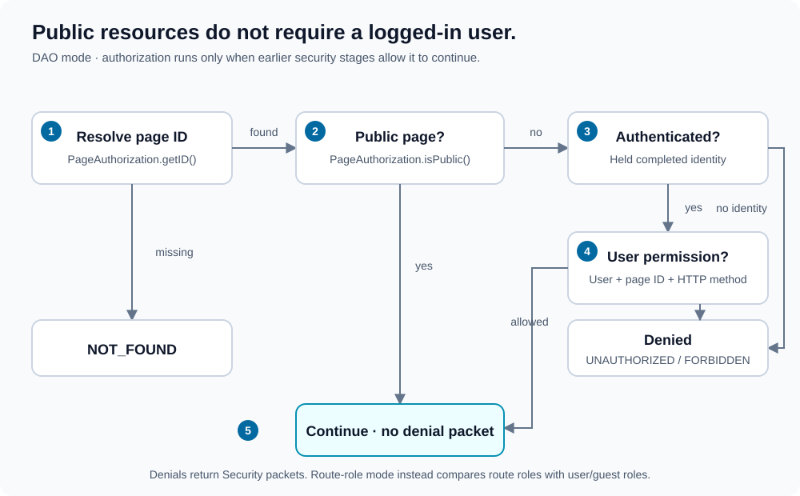

# Authorization

[Documentation map](index.md) · [Outcomes](outcomes.md)

Authorization evaluates the requested resource, not just whether login succeeded. Guests can access public resources, such as forum listings.



1. **Resolve the page:** `PageAuthorization::getID($route)` finds its database ID. No usable ID produces `NOT_FOUND`.
2. **Check public policy:** public pages are allowed for guests and authenticated users; user-specific permission checks are skipped.
3. **Require identity for private pages:** an absent authenticated identity produces `UNAUTHORIZED`.
4. **Check permission:** an authenticated user must pass `UserAuthorization::isAllowed($userID, $pageID, $method)`; rejection produces `FORBIDDEN`.
5. **Return the decision:** an allowed resource continues without an authorization packet. Denials become `Security` packets with configured callbacks.

This diagram describes DAO authorization. Route-role authorization uses the alternative policy below.

## DAO authorization

Configure `security.authorization.by_dao`:

```xml
<by_dao
    page_dao="App\Security\PageAuthorizationDAO"
    user_dao="App\Security\UserAuthorizationDAO"
    logged_in_callback="forbidden"
    logged_out_callback="login"
/>
```

All four attributes are required. The class attributes select implementations of [PageAuthorization](../src/DAO/PageAuthorization.php) and [UserAuthorization](../src/DAO/UserAuthorization.php), constructed without arguments.

The current interfaces are:

```php
// DAO\PageAuthorization
public function getID(string $pageURL): ?int;
public function isPublic(int $pageID): bool;

// DAO\UserAuthorization
public function isAllowed(
    int|string $userID,
    int $pageID,
    string $httpRequestMethod
): bool;
```

These are method signatures, not a standalone PHP program. Guest handling happens before the user-permission call; `isAllowed()` does not receive `null`. The current page-resolution check treats zero as missing, so use non-zero page IDs.

Make public policy explicit. Do not use a missing page record as a way to allow anonymous access.

## Route-role authorization

Alternatively configure `security.authorization.by_route`:

```xml
<by_route
    roles_dao="App\Security\UserRolesDAO"
    logged_in_callback="forbidden"
    logged_out_callback="login"
/>
```

All three attributes are required. The DAO implements [UserRoles](../src/DAO/UserRoles.php), whose `getRoles(int|string|null $userID): array` supports guest roles.

Route policies come from an application XML document, for example:

```xml
<application>
    <routes>
        <route id="forum" roles="guest,member,moderator" />
        <route id="account" roles="member,moderator" />
        <route id="moderation" roles="moderator" />
    </routes>
</application>
```

Prepare a detector and supply it in the fifth constructor argument:

```php
use Lucinda\WebSecurity\Configuration\RolesDetector;
use Lucinda\WebSecurity\Wrapper;

$rolesDetector = new RolesDetector($routesXml, "routes", "route", "id");
$wrapper = new Wrapper($securityXml, $request, [], null, $rolesDetector);
```

Any shared role allows access. A public forum can be represented by a `guest` route role and a DAO that returns `["guest"]` for `null`. Authenticated users must receive their own matching roles too.

An absent/empty route-role policy produces `NOT_FOUND`, not public access. A configured route without a matching role produces `UNAUTHORIZED` for guests or `FORBIDDEN` for authenticated users.

## Identity and workflow boundaries

Only held `AUTHENTICATED` state exposes a user ID to authorization. If pending state reaches authorization, it is represented as a guest.

Authorization runs only if earlier authentication/MFA stages return `null`. A login or MFA completion outcome can skip authorization on that request. Handle its callback and let the destination request pass through normal resource authorization.

Callbacks are response destinations, not permissions. The library returns the decision; the application chooses whether to render an error, redirect, or send an HTTP error status.
