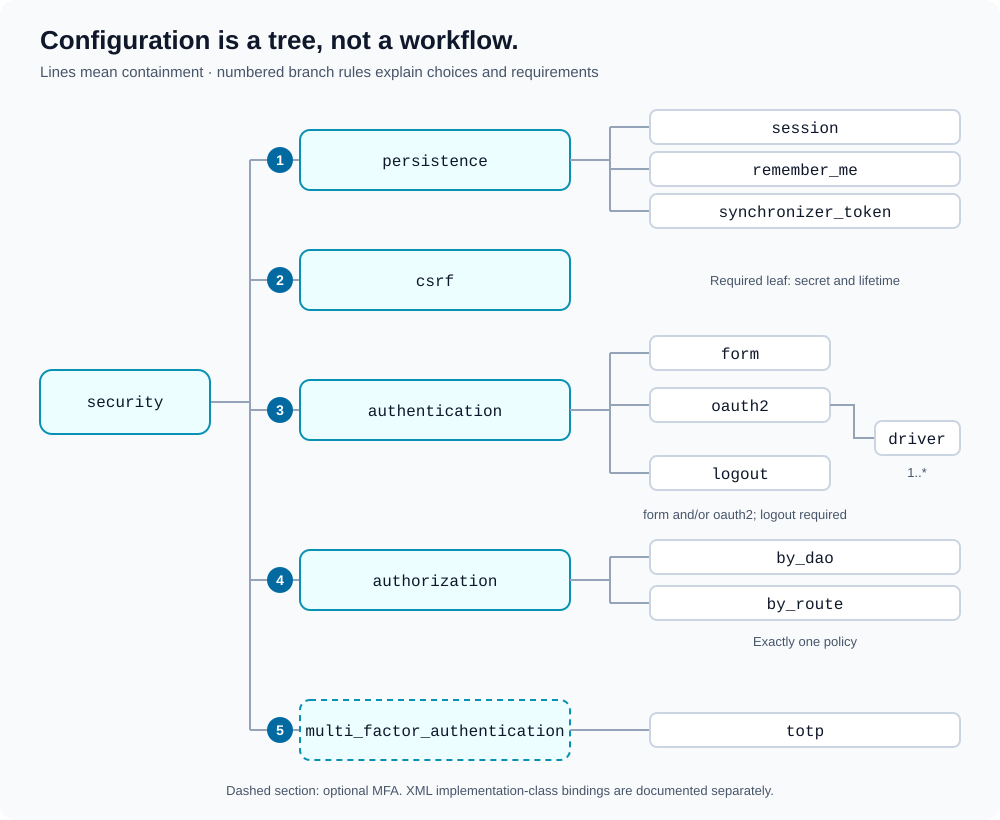

# XML configuration

[Documentation map](index.md) · [Quick start](quick-start.md)

Supply the complete application XML document to `Wrapper`, not the `security` element alone. Its document element can have an application-specific name; it must contain a `security` child.



## Branch rules

1. **Persistence:** configure `session`, `session` plus `remember_me`, or `synchronizer_token`. Remember-me requires sessions; bearer-token persistence cannot coexist with either cookie-based driver.
2. **CSRF:** a required `csrf` element supplies the secret and optional token lifetime.
3. **Authentication:** configure `form`, `oauth2`, or both. A separate `logout` sibling is required. OAuth2 needs at least one `driver` child.
4. **Authorization:** choose exactly one of `by_dao` and `by_route`.
5. **MFA:** the optional `multi_factor_authentication` section requires a `totp` child when present.

The tree expresses supported configuration structure, not a formal XSD or every parser rejection. Component guides document required attributes and implementation contracts.

## A starting document

The complete [session/form example](examples/security.xml) uses the current tag structure. In particular, form attributes belong directly on `form`, and `logout` is its sibling:

```xml
<authentication>
    <form
        dao="App\Security\FormLoginDAO"
        throttler="App\Security\FormLoginThrottler"
        page="login"
        target_success="home"
        target_failure="login"
        target_throttled="login-throttled"
    />
    <logout
        dao="App\Security\LogoutDAO"
        page="logout"
        target_success="login"
        target_failure="logout-failed"
    />
</authentication>
```

Self-closing configuration leaves are supported. Containers hold their required children; there is no need to add dummy text to the leaf tags.

## Class detection versus construction

XML attributes name autoloadable implementation classes. Configuration objects validate that those classes implement the required interfaces and retain the detected names. Deeper security code constructs the DAOs without constructor arguments.

These are different from the dependencies explicitly supplied to `Wrapper`:

| Dependency | Selected or supplied through |
| --- | --- |
| Credentials, logout, authorization, MFA, and throttling DAOs | XML class-name attributes. |
| OAuth2 provider services | Constructor array keyed by configured provider name. |
| OAuth2 state store | Constructor `OAuth2State` argument. |
| XML route-role policy index | Constructor `Configuration\RolesDetector` argument. |

## Attribute reference

| XML branch | Reference |
| --- | --- |
| `security.persistence` | [Persistence options](persistence.md#configuration). |
| `security.csrf` | [CSRF options](csrf.md#configuration). |
| `security.authentication.form` | [Form options](authentication.md#form-configuration). |
| `security.authentication.logout` | [Logout options](authentication.md#logout). |
| `security.authentication.oauth2` | [OAuth2 options](authentication.md#oauth2-configuration). |
| `security.authorization` | [Authorization options](authorization.md). |
| `security.multi_factor_authentication` | [MFA options](multi-factor-authentication.md#configuration). |

Durations are seconds. Numeric options are validated; cookie booleans use `0` or `1`. Route values must match the normalized request URI. Locally configured callbacks receive the request context-path prefix.

## Configuration hygiene

Keep secrets out of version control and replace all example values. Provision secret values using your deployment configuration process before passing the XML to the library; placeholder strings are not automatically expanded from environment variables.

Use separate secrets for distinct token purposes. Set cookie security attributes explicitly for your deployment, and keep XML-selected classes available through your autoloader.
