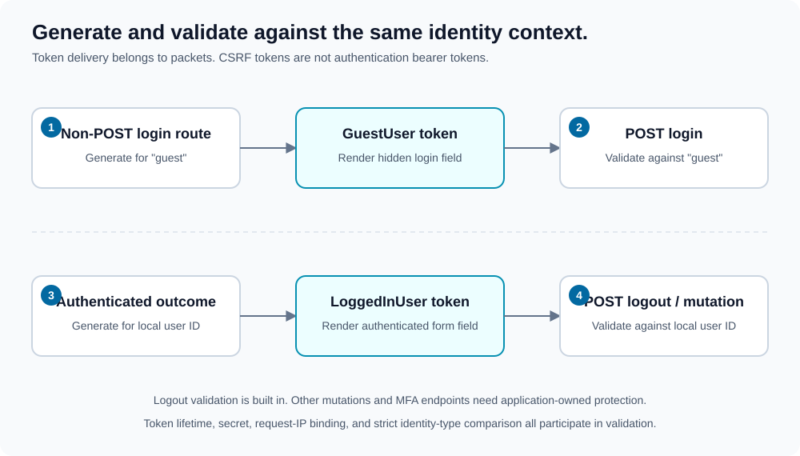

# CSRF protection

[Documentation map](index.md) · [Authentication](authentication.md) · [Outcomes](outcomes.md)

CSRF tokens establish that a submitted operation carries a valid token for the expected identity context. They are not authentication bearer tokens and cannot replace credentials or authorization.



1. **Guest login form:** the form handler generates a token for the `"guest"` context on a non-POST login-route request and returns it in `GuestUser`.
2. **Login submission:** the POST handler validates the configured CSRF field against that same `"guest"` context before checking credentials.
3. **Authenticated response:** outcome building generates a token for the local user ID and exposes it through `LoggedInUser`.
4. **Authenticated operation:** logout validates the token against the held local user ID. Other application mutations need their own validation integration.

## Configuration

```xml
<csrf secret="REPLACE_WITH_A_PRIVATE_CSRF_SECRET" expiration="600" />
```

`security.csrf` is required. `secret` is required; `expiration` is an optional positive lifetime, defaulting to `600` seconds.

Form and logout configuration each select the submitted field name through their `csrf` attribute, defaulting to `csrf`.

## Render the login token

```php
use Lucinda\WebSecurity\Packets\GuestUser;

if ($outcome instanceof GuestUser) {
    $csrfToken = $outcome->getCsrfToken();
    // Pass the token to the login template; escape it as an HTML attribute.
}
```

For example, inside a PHP template that receives `$csrfToken`:

```html
<input
    type="hidden"
    name="csrf"
    value="<?= htmlspecialchars($csrfToken, ENT_QUOTES, 'UTF-8') ?>"
>
```

Ordinary guest pages do not require a generated login token. There is no `Wrapper::getCsrfToken()` getter: token data belongs to the relevant returned packet.

## Validate other authenticated operations

The library automatically checks form login and logout. It does not automatically enforce CSRF validation on every application route or MFA endpoint.

For an application-specific authenticated mutation, first handle the security outcome and establish the appropriate identity/authorization, then validate the submitted token:

```php
use Lucinda\WebSecurity\Configuration;
use Lucinda\WebSecurity\Detectors\CsrfToken;
use Lucinda\WebSecurity\Packets\LoggedInUser;

// This branch belongs after your outcome handling and resource-access checks.
if ($outcome instanceof LoggedInUser) {
    $configuration = new Configuration($xml);
    $validator = new CsrfToken($configuration->getCsrf(), $request->getIpAddress());
    $submittedToken = $request->getParameters()["csrf"] ?? null;

    if (
        $request->getMethod() !== "POST"
        || !is_string($submittedToken)
        || !$validator->isValid($submittedToken, $outcome->getUserID())
    ) {
        throw new RuntimeException("CSRF validation rejected the operation.");
    }

    // Perform the already-authorized mutation.
}
```

The exception above is illustrative application response policy, not a library-generated outcome. Choose your own rejection response.

## Important behavior

Tokens are encrypted and bound to their configured lifetime and request IP. Identity comparison is strict, so preserve user-ID types consistently.

Generating a new token does not revoke older unexpired tokens for the same context. `getOutcome()` rebuilds the authenticated public packet and can generate a token each time; prefer calling it once.

Exclude tokens from logs, escape rendered fields, use HTTPS, and configure an appropriate browser cookie policy. Decide explicitly how non-cookie API authentication affects your application's CSRF threat model.
