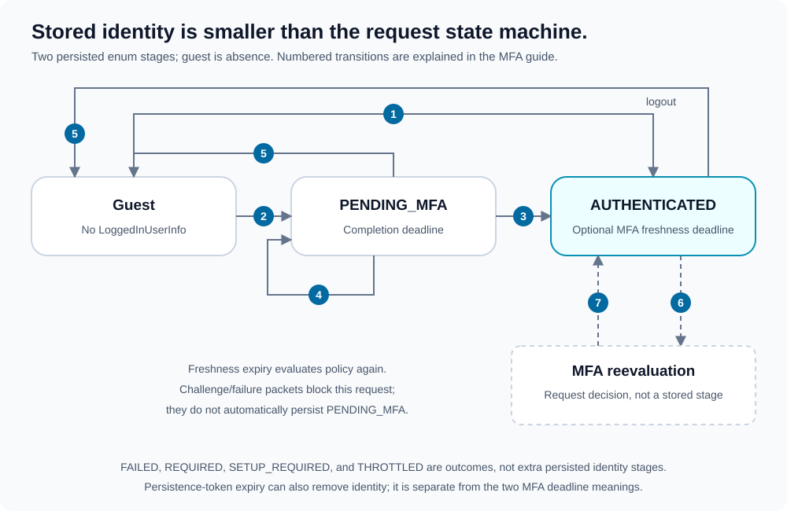

# Multi-factor authentication

[Documentation map](index.md) · [Authentication](authentication.md) · [Persistence](persistence.md)

MFA is optional configuration, with per-user requirements decided by the application DAO. The current method is TOTP: enrollment confirms a temporary secret; challenges verify an enrolled secret.

## Authentication lifecycle



1. **Primary login without MFA configuration:** a verified identity becomes `AUTHENTICATED`, with no MFA freshness deadline.
2. **Primary login with MFA configuration:** the identity becomes `PENDING_MFA`, with a deadline calculated from `pending_expiration`. Remember-me preference is recorded, but remember-me persistence is not written.
3. **Complete pending authentication:** `SUCCEEDED` promotes the user with a new freshness deadline; `NOT_REQUIRED` promotes without one. Selected persistence drivers receive the completed state.
4. **Keep pending:** challenge, setup, rejected-code, and throttling outcomes do not promote the identity. Pending completion remains bounded by the original deadline.
5. **Expire or log out:** a missing/reached pending deadline produces `EXPIRED` and clears state. Accepted logout clears either persisted authentication stage.
6. **Reevaluate authenticated identity:** a non-null freshness deadline in the future skips MFA. An absent or reached deadline evaluates current MFA policy and may require setup or a new challenge.
7. **Finish reevaluation:** successful verification refreshes persisted authentication. `NOT_REQUIRED` lets an already authenticated user continue. Required/setup/failure/throttling outcomes stop later security stages on that request.

There are only two persisted enum stages: `PENDING_MFA` and `AUTHENTICATED`. Guest means absence of `LoggedInUserInfo`. The dashed reevaluation box is request processing, not a third persisted enum stage.

In the current implementation, a challenge during authenticated reevaluation does not itself rewrite the held stage to `PENDING_MFA`. The challenge packet blocks further stages for that request. Handle it; do not grant access just because it carries a user ID.

## Two MFA deadlines

| State / setting | What expires | Effect |
| --- | --- | --- |
| `PENDING_MFA` / `pending_expiration` | Time allowed to finish primary-login MFA. | Pending identity is cleared; primary authentication must restart. |
| `AUTHENTICATED` / `expiration` | Freshness of a successful MFA approval. | MFA policy is evaluated again; previous completion is not permanently sufficient. |

These are separate from the TOTP `period`, CSRF lifetime, and persistence-token lifetime. Renewing a bearer token does not renew MFA approval.

If the user does not require MFA, successful authentication can legitimately have no MFA freshness deadline. With MFA configured, that absence allows policy reevaluation on subsequent requests.

## Configuration

Add this child of `security`:

```xml
<multi_factor_authentication
    dao="App\Security\MultiFactorAuthenticationDAO"
    throttler="App\Security\MultiFactorAuthenticationThrottler"
    pending_expiration="120"
    expiration="600"
    challenge_route="mfa/challenge"
    setup_route="mfa/setup"
    success_route="home"
    failure_route="mfa/failed"
    throttled_route="mfa/throttled"
>
    <totp issuer="My application" code_param="otp" />
</multi_factor_authentication>
```

All attributes on `multi_factor_authentication` shown above are required. Both durations must be positive integers. The DAO implements `DAO\MultiFactorAuthentication`; the throttler implements `DAO\Throttler\MultiFactorAuthentication`.

TOTP options:

| Attribute | Required / default |
| --- | --- |
| `issuer` | Required authenticator issuer label. |
| `code_param` | Optional submitted field name; `code`. |
| `period` | Optional positive time-step duration; `30` seconds. |
| `digits` | Optional; `6`, with supported values `6`, `7`, and `8`. |
| `window` | Optional non-negative adjacent-step tolerance; `1`. |

## Enrollment and challenge

The DAO checks `isRequired($userID)` before throttling or enrollment lookup.

If MFA is required and no enrolled secret exists, the workflow reuses or creates a temporary setup secret and returns `SETUP_REQUIRED` with the secret and provisioning URI. Render this only to the appropriate identified user. A provisioning URI can be encoded into a QR image by the application.

Submitting a code via POST to the setup route verifies and consumes its matched counter before calling `enable()` and `clearSetupSecret()`. Saving a temporary secret must not enable the factor.

For enrolled users, a request outside the challenge route returns `REQUIRED`; POST to the challenge route verifies the submitted code. Missing codes return the requirement rather than recording a rejected-code penalty.

The application owns route rendering and any additional CSRF/transport protection for MFA endpoints. The MFA handler does not automatically validate a CSRF field.

## DAO responsibilities

See the exact [MFA interface](../src/DAO/MultiFactorAuthentication.php):

| Methods | Responsibility |
| --- | --- |
| `isRequired()`, `getAccountName()` | User policy and authenticator account label. |
| `getSecret()` | Enrolled Base32 secret, or `null`. |
| `getSetupSecret()`, `saveSetupSecret()` | Temporary enrollment storage across requests. |
| `enable()`, `clearSetupSecret()` | Confirm enrollment and remove temporary material. |
| `consumeTotpCounter()` | Atomic replay protection for a matched TOTP counter. |

Counter consumption must atomically reject counters less than or equal to the last consumed counter, including concurrent submissions. Preserve the consumed setup counter when enabling the enrolled secret.

Treat secrets, provisioning URIs, bearer tokens, and submitted codes as sensitive. Do not log them. The separate [throttling policy](throttling.md) records rejected MFA attempts using both user ID and client IP.
