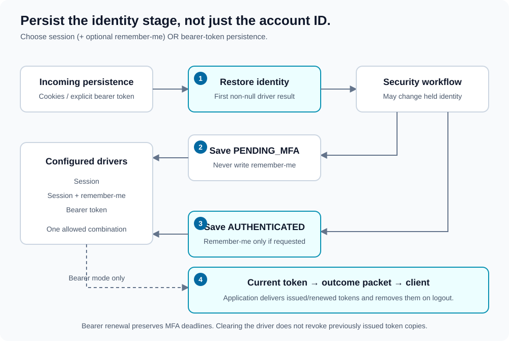

# Identity persistence

[Documentation map](index.md) · [MFA](multi-factor-authentication.md) · [Outcomes](outcomes.md)

Persistence carries internal identity state between requests. It stores a `LoggedInUserInfo` record, not merely a user ID: authentication stage, remember-me preference, and any stage-specific deadline matter.



1. **Restore:** drivers are checked in configured order. The first non-null identity is used. With session plus remember-me, sessions are checked first.
2. **Save pending identity:** after primary credentials with MFA configured, save `PENDING_MFA` to session or bearer persistence; skip remember-me.
3. **Save completed identity:** after accepted login/MFA, save `AUTHENTICATED`. Write remember-me only when the recorded preference requests it.
4. **Deliver bearer tokens:** a bearer driver exposes its current issued/renewed token. Outcome building attaches an available non-empty token; the application sends and stores it through its chosen client protocol.

## Configuration

Allowed combinations are:

| Configuration | Purpose |
| --- | --- |
| `session` | Session-based identity. |
| `session` + `remember_me` | Session identity with an optional persistent remember-me cookie. |
| `synchronizer_token` | Identity carried in an explicit authentication bearer token. |

Remember-me requires session persistence. Bearer persistence is mutually exclusive with both cookie-based drivers.

### Sessions

```xml
<persistence>
    <session
        parameter_name="lucinda_session"
        is_http_only="1"
        is_https_only="1"
        same_site="Lax"
    />
</persistence>
```

| Attribute | Behavior |
| --- | --- |
| `parameter_name` | Optional session entry name for stored identity; `uid`. It does not rename PHP's session cookie. |
| `expiration` | Optional positive lifetime in seconds; absent configuration passes a zero cookie lifetime to the driver. |
| `is_http_only` | Optional `0`/`1`. |
| `is_https_only` | Optional cookie Secure flag, `0`/`1`. |
| `same_site` | Optional `Lax`, `Strict`, or `None`. |
| `handler` | Optional application session-handler class, constructed without arguments. |

Cookie flags should be explicit. Unspecified HttpOnly/Secure flags map to false in the current wrappers. PHP session storage and server-side session lifetime also depend on your environment. Session loading refreshes the driver's idle deadline; a zero configured duration disables that idle-expiry check.

### Remember-me

Add a `remember_me` sibling to `session`:

```xml
<remember_me
    parameter_name="lucinda_remember"
    secret="REPLACE_WITH_A_PRIVATE_REMEMBER_SECRET"
    expiration="86400"
    is_http_only="1"
    is_https_only="1"
    same_site="Lax"
/>
```

`secret` is required. The remember-me cookie name defaults to `uid`; avoid colliding with PHP's configured session cookie name. Cookie options follow the session options, except `handler` is not a remember-me option.

Set an explicit positive `expiration` for remember-me. The current configuration object inherits nullable expiration parsing; do not rely on the declared default constant to supply an omitted lifetime.

The primary-login request records the remember-me field preference. Pending MFA does not issue a remember-me cookie; completion uses that recorded preference.

### Authentication bearer tokens

```xml
<persistence>
    <synchronizer_token
        secret="REPLACE_WITH_A_PRIVATE_AUTHENTICATION_SECRET"
        expiration="3600"
        regeneration="60"
    />
</persistence>
```

`secret` is required. `expiration` defaults to `3600` seconds and `regeneration` to `60` seconds; XML values must be positive integers.

Extract only the token value, without its authorization-scheme prefix:

```php
// $authorizationHeader comes from your HTTP framework.
$accessToken = "";
if (preg_match('/^Bearer\s+(\S+)$/i', $authorizationHeader, $matches) === 1) {
    $accessToken = $matches[1];
}
$request->setAccessToken($accessToken);
```

After execution, retrieve any replacement from the returned packet:

```php
$outcome = $wrapper->getOutcome();
$accessToken = $outcome?->getAccessToken();

if ($accessToken !== null) {
    // Deliver through your application's defined response protocol.
    // The client replaces its previously stored authentication token.
}
```

Retrieve the token before committing response headers/body. A token can be attached to a challenge or failure packet as well as `LoggedInUser`; it is not by itself proof of completed authentication.

## Promotion, expiry, and renewal

Pending bearer tokens encode `PENDING_MFA`. Successful MFA replaces them with authenticated-state tokens. Returning that new token is essential for a client to retain the promoted state.

Loading validates encryption/integrity, client-IP binding, and token expiry. Expired tokens yield absent identity; malformed or invalid tokens can throw. Eligible live tokens are renewed on load. Renewal preserves the identity record, including its MFA deadline, rather than refreshing approval.

The configured request IP is also used for token binding. Changes in the client IP can invalidate a token; normalize proxy handling consistently.

## Logout and revocation

Accepted logout asks every driver to clear state. The coordinator attempts all cleanup operations and reports failures. A failed save also triggers compensating cleanup.

Session/cookie drivers can update browser persistence headers. Session cleanup clears the entire PHP session, not only its identity entry; account for unrelated application session data. Bearer `clear()` removes the current driver's value but does not revoke previously issued copies. The current outcome builder does not attach an empty cleared token.

The application must remove its client-stored bearer token when handling successful logout. If your application requires server-side revocation of issued bearer or remember-me token copies before expiry, that needs an additional revocation design; the current stateless token driver does not provide it.
