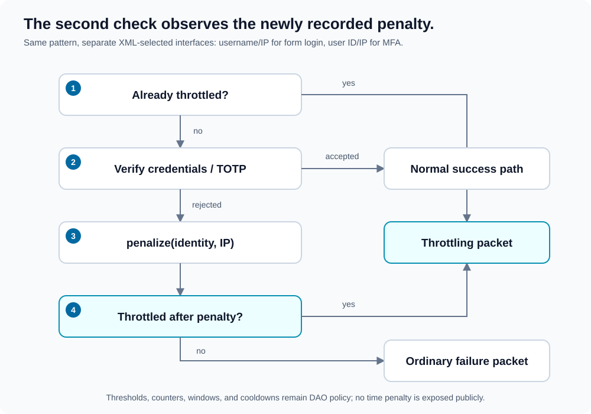

# Throttling

[Documentation map](index.md) · [Authentication](authentication.md) · [MFA](multi-factor-authentication.md)

Throttling is deep security policy selected through XML, not an additional object the caller must pass to `Wrapper`. The application implements durable checks and penalties; the state machine exposes only the resulting blocked outcome.



1. **Check before verification:** if the policy already blocks the attempt, return a throttling packet without credential/code verification or an additional penalty.
2. **Attempt verification:** form login validates parameters and CSRF before its credentials DAO; MFA checks user policy and uses its TOTP verification/counter-consumption path.
3. **Penalize a rejection:** rejected credentials or a rejected/replayed MFA code call the relevant `penalize()`.
4. **Check after the penalty:** a previously allowed attempt may have reached the threshold. Return throttling if blocked now, otherwise the ordinary failure packet.

The diagram abstracts the penalty path. Missing/invalid form parameters and rejected CSRF do not record a credential penalty; missing MFA codes return challenge/setup requirements without a rejected-code penalty. MFA users not requiring a factor bypass its throttler.

## Two interfaces, one pattern

| Concern | XML selector | Interface | Attempt context |
| --- | --- | --- | --- |
| Form login | `authentication.form@throttler` | [DAO\Throttler\FormLogin](../src/DAO/Throttler/FormLogin.php) | Submitted username and client IP. |
| MFA | `multi_factor_authentication@throttler` | [DAO\Throttler\MultiFactorAuthentication](../src/DAO/Throttler/MultiFactorAuthentication.php) | Local user ID and client IP. |

Both provide `penalize(...): void` and `isThrottled(...): bool`. The different identity types reflect the information available at each stage.

```xml
<form
    dao="App\Security\FormLoginDAO"
    throttler="App\Security\FormLoginThrottler"
    page="login"
    target_success="home"
    target_failure="login"
    target_throttled="login-throttled"
/>
```

MFA configuration selects its separate throttler and `throttled_route`; see [the full MFA example](multi-factor-authentication.md#configuration).

Configuration detects and validates the classes. Deeper code constructs them without arguments.

## Application policy responsibilities

The interfaces deliberately do not prescribe a fixed threshold, storage engine, or time penalty. Your implementation owns:

- Durable counters/windows shared across requests and workers.
- Expiry, cooldown, escalation, and any reset behavior.
- Atomic updates appropriate for concurrent requests.
- How the supplied identity and IP contribute to blocking.

For MFA, the supplied user ID and IP allow a caller-specific policy rather than automatically locking every client of an account. The interface does not force a particular key; design this deliberately so an attacker who knows credentials cannot trivially deny the owner access.

Broader IP/account limits or edge rate limiting can complement these DAOs, but are not automatically supplied by the library.

## Caller-visible behavior

Form blocking returns `Throttling` with `Authentication\ResultStatus::LOGIN_THROTTLED`. MFA blocking returns it with `MultiFactorAuthentication\ResultStatus::THROTTLED`.

The configured callback is attached for the caller to handle. No public time-penalty getter exists. The caller may render a blocked-attempt response or follow the callback, but cannot derive a retry deadline from this packet alone.

The post-penalty check is intentional: the pre-check and post-check observe different policy state.
